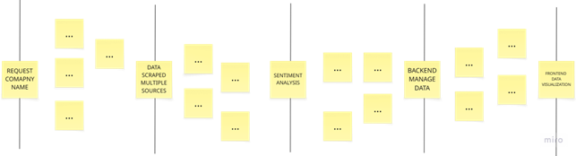
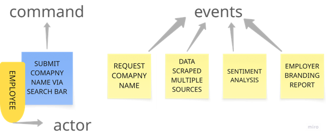
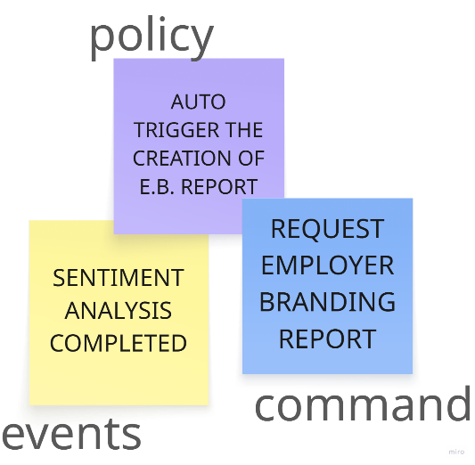
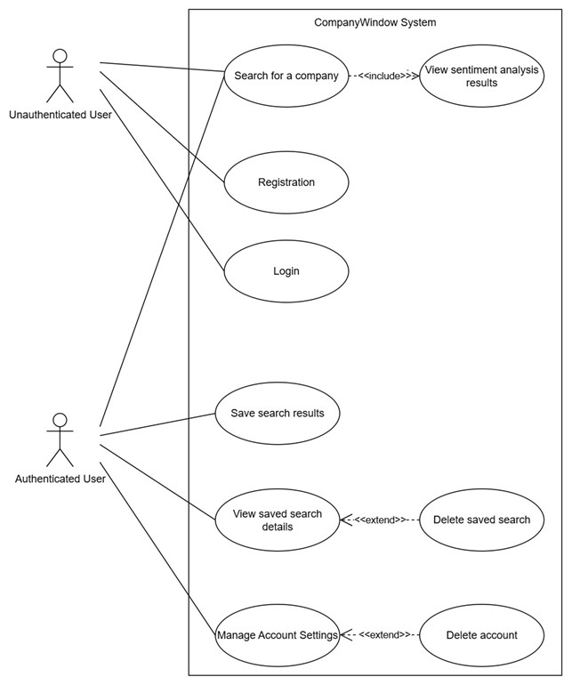

# **Concept**

In software development and system design, it is essential to use multiple techniques to ensure a deep understanding of user needs and system behaviour. No single approach can address all aspects of a project, which is why we use a combination of methods.

## **Doing Event Storming**

Brainstorm of the domain events related to the business domain – a ***domain event*** is something interesting that has happened in the business. 

“Happy path scenario” – the flow that describes a successful business scenario:

-	Request for a Company - Company Name Searched
-	API Request Received
-	Data Scraped from many sources
-	New Data Source Added
-	API Response Sent
-	Employer Branding Report Created
-	Sentiment Analysis Result Returned
-	Data Visualization Generated

These events, also known as *"pivotal events"*, define the workflow and effectiveness of the CompanyWindow software.

In the context of the EventStorming process, identifying ***pain points*** is critical to understanding areas where the process or system may face challenges, inefficiencies or potential failures. Here are a few potential pain points:

1.	Data accuracy and reliability. 
    * Challenge: Scraping data from sources can result in inconsistent or incomplete data, which can affect the accuracy of sentiment analysis and the overall reliability of the employer branding report.
    * Impact: Inaccurate data can lead to incorrect sentiment analysis, leading to false results and ultimately poor decision making by HR or marketing teams.
    * Mitigation: Implement data validation and error handling mechanisms to ensure that only accurate and reliable data is used for analysis.

2.	Complexity of sentiment analysis 
    * Challenge: Sentiment analysis is inherently complex, especially when dealing with nuances such as sarcasm, context or mixed sentiments within a single review.
    * Impact: Inaccurate sentiment classification can lead to incorrect conclusions about a company's reputation, potentially compromising its branding efforts.
    * Mitigation: Continuously improving the sentiment analysis model with machine learning and embedding feedback loops can help improve accuracy over time.

3.	Data Visualization - UI
    * Challenge: Presenting data in a clear and intuitive way can be challenging, especially when dealing with large datasets or complex insights such as sentiment trends over time. Badly designed interfaces can make it hard for users to navigate.
    * Impact: When users cannot easily interpret data or trends, the value of the analysis is compromised, causing misunderstandings or poor decisions by HR teams. A messy interface can discourage users from engaging with the platform at all.
    * Mitigation: Focus on user-centred design principles by creating simple, clean and interactive dashboards. Implement data filtering options, drill-down capabilities, and visual representations (e.g., charts, colour coding) that make complex data easier to digest. Regular user feedback should be incorporated to refine and improve the interface.

A ***command*** describes what triggered the event or flow of events, describing the system’s operations. In other word, commands represent actions that are executed to trigger domain events. 

For example:

1.	*Submit company name for search*
    + Actor: Prospective Employee
    + Event Triggered: Company Name Searched 
2.	*Scrape data from Glassdoor (sources)*
    + Actor: Software  
    + Event Triggered: Request for Data Scraped from Glassdoor
3.	*Analyze sentiment of reviews*
    + Actor: Software or the person behind the software, for example a Data Analysis.
    + Event Triggered: Request Sentiment Analysed Result of data collected
4.	*Request employer branding report*
    + Actor: HR Manager
    + Event Triggered: Employer Branding Report Created

A particular command is executed by an actor in a specific role. ***Actors***:

-	*HR Manager*. Responsible for monitoring employer branding and analysing employee feedback.
-	*Prospective employee*. A potential candidate looking for real feedback about a company.

An automation ***policy*** is a scenario in which an event triggers the execution of a command. An automation policy that triggers the “Return sentiment analysis result” command when the “Analysis of the company is completed” event is observed. 
Policy, a command that is automatically executed when a specific domain event occurs. 

Other examples:

+   *Automatic Execution*: Once the "Company Name Searched" event occurs, the system automatically triggers data scraping from sources.
+   *Report Generation*: After sentiment analysis is complete, the policy triggers the generation of the Employer Branding Report.

## **Use Cases Collection**

A **use case** can be conceived as a set of scenarios tied together by a common user goal.  
A **scenario** is a sequence of steps describing an interaction between a user and a system.  
A use case lists the steps required to achieve a goal from the user’s point of view, including interactions between users and systems. It provides a narrative of how a system is used.

To better understand the functionalities and user interactions within the **CompanyWindow** platform, we created a **use case diagram** and **user stories**.

- **Use case diagram** offers a visual overview of the system’s main features, such as company analysis, account management, and data saving.  
  It show how different user (authenticated and unauthenticated) interact with these features.
- **User stories** complement this by focusing on specific goals and motivations.  
  Written from the user's perspective, they help guide the design of intuitive and meaningful features that respond to real needs.

## Unauthenticated User Use Cases

### Use Case 1 — Analyze a Company
- **Actor:** Unauthenticated User  
- **Description:** The user enters a company name to view sentiment analysis and review insights.  
- **Precondition:** The user is on the homepage.  
- **Main Scenario:**
  1. User enters company name and clicks "Analyze".
  2. System processes the request and displays analysis results.  
- **Postcondition:** The user views the company’s sentiment and review summary.

### Use Case 2 — Registration
- **Actor:** Unauthenticated User  
- **Description:** The user creates an account to access personalized features.  
- **Main Scenario:**
  1. User fills in the registration form with personal details.
  2. System creates the account.  
- **Postcondition:** The user becomes authenticated.

### Use Case 3 — Login
- **Actor:** Unauthenticated User  
- **Description:** The user logs into the system.  
- **Main Scenario:**
  1. User enters email and password.
  2. System verifies credentials and grants access.  
- **Postcondition:** The user is authenticated.

---

## Authenticated User Use Cases

### Use Case 4 — Save Search Result
- **Actor:** Authenticated User  
- **Description:** The user saves a company analysis for future reference.  
- **Main Scenario:**
  1. User clicks "Save" on the analysis page.
  2. Optionally adds personal notes.  
- **Postcondition:** The analysis is stored in the user’s library.

### Use Case 5 — View Saved Searches
- **Actor:** Authenticated User  
- **Description:** The user accesses previously saved analyses.  
- **Main Scenario:**
  1. User navigates to "Saved Searches".
  2. System displays the list of saved items.  
- **Postcondition:** The user views saved data.

### Use Case 6 — View and Edit Saved Search Detail
- **Actor:** Authenticated User  
- **Description:** The user opens a saved analysis and edits notes.  
- **Main Scenario:**
  1. User selects a saved item.
  2. System displays full analysis and notes.
  3. User edits and saves notes.  
- **Postcondition:** Notes are updated.

### Use Case 7 — Manage Account Settings
- **Actor:** Authenticated User  
- **Description:** The user updates account information.  
- **Main Scenario:**
  1. User accesses account settings.
  2. Updates email, password, or company (if HR Manager).  
- **Postcondition:** Account data is updated.

### Use Case 8 — Delete Account
- **Actor:** Authenticated User  
- **Description:** The user removes their account from the system.  
- **Main Scenario:**
  1. User selects "Delete Account".
  2. Confirms the action.  
- **Postcondition:** Account is permanently deleted.

---

## User Stories

### Related to Functions and Tools
- As a user, I want to save companies I’m interested in, so that I can easily revisit them later without searching again.
- As a user, I want to view all my saved searches, so that I can revisit previous analyses.
- As a user, I want to add personal notes to a saved search, so that I can record my thoughts.

### Log In and Access
- As a user, I want an option to log in/register, so that I can visualize my saved searches on every device.
- As a user, I want to be able to easily sync my app data across multiple devices, so that I can access my information from anywhere.

### UI/UX
- As a user, I want a clean and intuitive interface, so that I can navigate the platform without confusion or frustration.
- As a user, I want to see a loading message while the system processes the analysis, so that I understand something is happening.

### Benefits and Necessities
- As a user, I want to view a summary, sentiment score, pros and cons, and visual elements, so that I can evaluate the company quickly.
- As a user (HR), I want to see the overall rating given by the company’s employees, so that I can understand what to improve and build an employer branding strategy.
- As a user (HR), I want to see the most used negative words in reviews, so that I can address key issues.
- As a user (HR), I want to see the most used positive words in reviews, so that I can understand what employees find favorable about the company.
- As a user (Prospective Employee), I want to see the overall rating given by the company’s employees, so that I can choose carefully where to apply.
- As a user (Prospective Employee), I want to see the most used negative words in reviews, so that I can see potential drawbacks of joining the company.
- As a user (Prospective Employee), I want to see the most used positive words in reviews, so that I can evaluate the potential benefits of joining the company.

### Account Management
- As a user, I want to update my email, password, and company (if HR Manager), so that my account stays accurate.
- As a user, I want to delete my account, so that I can remove my data from the system.