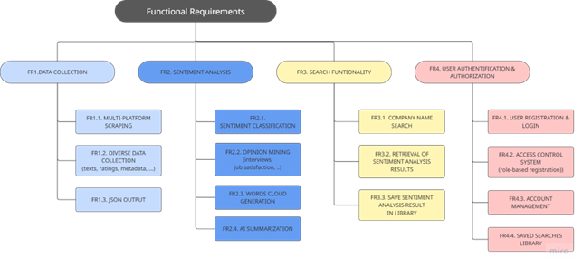

# Requirements

The definition of requirements for the "CompanyWindow" project adopted an **iterative approach**. While the ultimate goal of the system was clear from the outset – to provide an effective platform for **collecting, analyzing, and presenting employee feedback and company insights** – the inherent nature of the problem and the potential variety of technical solutions made this approach particularly suitable. This methodology allowed us to initially define requirements at a high level of abstraction, and then progressively refine and detail them through cycles of feedback and analysis. This approach ensures the necessary flexibility to integrate new insights and adapt to any changes, optimizing development towards the most effective solution.

# Functional Requirements

The following are the key functional requirements of the system, which describe the features the application must provide to meet user needs.

### FR1: Data Collection 
The system must collect employee reviews from multiple online platforms like Glassdoor and Indeed (FR1.1). This process should gather diverse data, including text, ratings, and metadata (FR1.2), and export it in a structured JSON format for easy processing (FR1.3).

### FR2: Sentiment Analysis 
The system must process and visualize the collected data to provide meaningful insights. This includes classifying reviews by sentiment (FR2.1), performing opinion mining on specific topics (FR2.2), generating word clouds (FR2.3), and providing AI-powered summaries (FR2.4).

### FR3: Search Functionality
Users must be able to efficiently find and manage information related to companies. This involves searching for companies by name (FR3.1), retrieving the results of sentiment analysis (FR3.2), and allowing authenticated users to save these search results to a personal library (FR3.3).

### FR4: User Authentication & Authorization
The system must ensure secure and controlled access to its features. This is managed through user registration and login (FR4.1), a role-based access control system (FR4.2), account management features for updating user information (FR4.3), and a personal library for saved searches (FR4.4).

--- 

The Requirement Breakdown Structure (RBS) provides a hierarchical view of the functional requirements, detailing how the main requirements are broken down into more granular sub-requirements.

# Non-Functional Requirements 

Non-functional requirements specify criteria used to judge the operation of a system, rather than specific behaviors.

- **NFR1: Performance**: The application must efficiently handle the scraping and processing of large datasets without significant delays. API calls and user queries should have fast response times, typically within 2 seconds.
- **NFR2: Scalability**: The system must scale to support multiple companies, large datasets, and an increasing number of data sources and reviews without performance degradation.
- **NFR3: Security**: Data security is essential, with encryption of both user and corporate data (e.g., AES-256), Role-Based Access Control (RBAC), and encrypted data transfers (SSL/TLS).
- **NFR4: Availability**: The system must be highly available, operating 24/7 with minimal downtime for maintenance or upgrades, and should recover quickly from failures.
- **NFR5: Data Accuracy**: The system must ensure the accuracy, consistency, and timeliness of scraped data.
- **NFR6: Usability**: The user interface should be intuitive and follow usability best practices, with clear, interactive visual reports.
- **NFR7: Maintainability**: The codebase should follow clean coding standards and be well-documented, with a modular architecture allowing independent component updates.
- **NFR8: Cross-Platform Support**: The application must work seamlessly across multiple devices and platforms, including desktops, tablets, and mobile devices, with a responsive design.

# Implementation Requirements (IRs)

Implementation requirements specify the technical and architectural decisions crucial for the system's development.

- **IR1: Backend API Development**: Develop a RESTful API using Node.js with the Express.js framework. The API will handle communication between the frontend and the Python scripts, and it will connect to a MongoDB database for the persistence of data related to users and saved searches.
- **IR2: Web Scraping Framework**: Implement web scraping using frameworks to gather data from various sources.
- **IR3: Sentiment Analysis Implementation**: Use natural language processing techniques to perform sentiment analysis and opinion mining.
- **IR4: Frontend User Interface**: Build the web interface using React and TypeScript with the Vite build tool. Tailwind CSS will be used for styling to ensure a clean and responsive design.

# Conditions of Satisfaction (CoS)

These describe the primary implications and complexities involved in realizing a specific requirement.

- **CoS for FR1 (Data Collection)**: Requires continuous maintenance and adaptation to changes in target website structures. It involves managing IP rotation and CAPTCHA handling for reliable data acquisition.
- **CoS for FR2 (Sentiment Analysis)**: Demands significant computational resources for natural language processing model training and inference. Requires ongoing model refinement to adapt to evolving language and domain-specific terminology.
- **CoS for NFR1 (Performance)**: Implies continuous monitoring and optimization of database queries, API endpoints, and data processing pipelines to meet stringent response time targets under load. 

# Acceptance Criteria (AC)

Acceptance Criteria (AC) These are verifiable conditions that define when a specific requirement has been successfully implemented and is ready for user acceptance.

### AC for FR1 (Data Collection)
- It is hypothesized that, if new reviews are available on external platforms (e.g., Indeed, Glassdoor), when the system performs scraping, the reviews will be collected and stored in a valid JSON format, with an estimated failure rate of less than 5% due to external factors (such as changes in website structures). The system should still handle and log these failures appropriately.

### AC for FR2 (Sentiment Analysis)
- It is hypothesized that, given a set of reviews, when the analysis is performed, sentiment classification will reach an estimated accuracy of 85%, and both a word cloud and an AI-generated summary will be produced.

### AC for FR3 (Search Functionality)
- Given a user submits a search query for a company, when the request is sent to the backend, then the system responds within 2 seconds with an acknowledgement, and the complete analysis report is delivered to the frontend within 2 minutes (depending on the number of pages scraped). The system should provide an appropriate loading message during this time.

### AC for FR4 (User Authentication & Saved Searches)
- Given a logged-in user, when they attempt to save a search, then the search is successfully stored in their personal library.
- Given a logged-in user, when they update their email address, then the change is successfully saved and the new email is used for subsequent logins.
- Given a logged-in user, when they change their password, then the new password is correctly stored and can be used for future logins.
- Given an HR Manager, when they update their company name in the account settings, then the change is reflected correctly in the system.
- Given a user with a valid account, when they request to delete their profile, then all associated data is securely removed from the database.

#### AC for NFR1 (Performance)
- Given a user submits a search query, then the system responds within 2 seconds with a confirmation, and the complete analysis report is delivered within 2 minutes (depending on the number of pages to scrape). This time should be clearly communicated to the user.

#### AC for NFR2 (Scalability)
- Given the system is used by 20 concurrent users, when operations are performed, then the system remains stable without crashing, and the individual requests are correctly queued and processed, even if the total processing time increases.

#### AC for NFR3 (Security)
- Given a security audit, when security protocols are tested, then compliance with modern standards (e.g., OWASP) is confirmed and data is encrypted.

#### AC for NFR4 (Availability)
- It is hypothesized that, given the system is monitored, when monthly uptime is measured, it will exceed 99.9%.

#### AC for NFR5 (Data Accuracy) 
- It is hypothesized that, given data validation processes, when data is compared, sentiment and data collection accuracy will be above 95%.

#### AC for NFR6 (Usability)
- Given a user interacts with the interface, when they navigate, then the design is intuitive, and visualizations like the word cloud are clear and interactive.

#### AC for NFR7 (Maintainability)
- Given a component needs an update, when a change is made, then the update can be performed independently without affecting other components.

#### AC for NFR8 (Cross-Platform Support)
- Given the application is viewed on various devices, when the screen size changes, then the interface adapts responsively without compromising the user experience.

