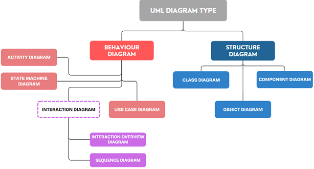
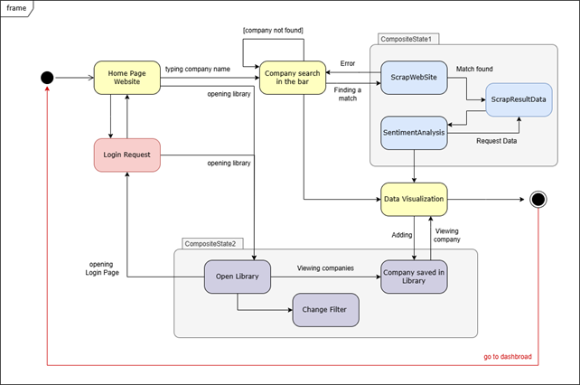
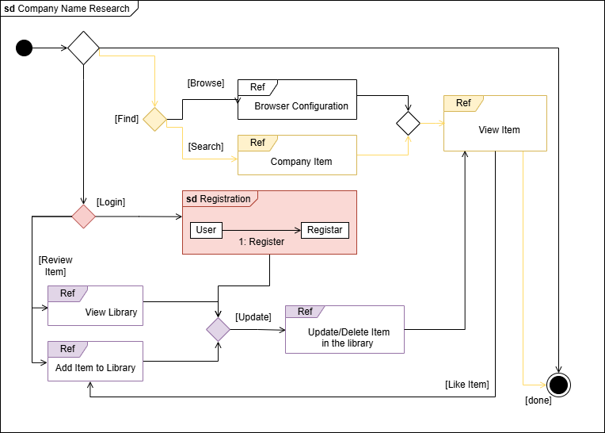
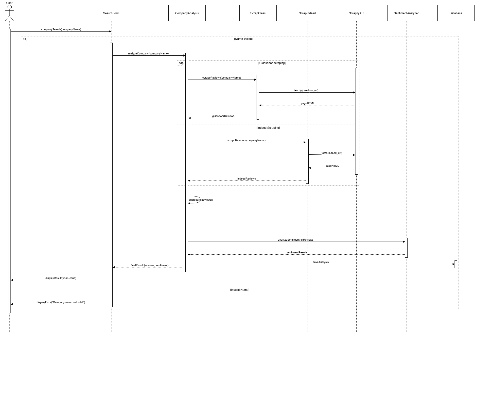
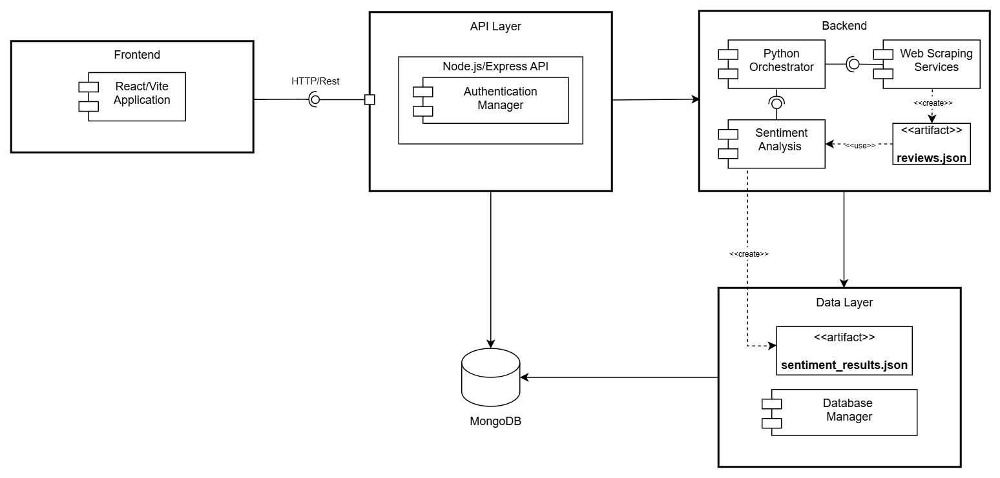
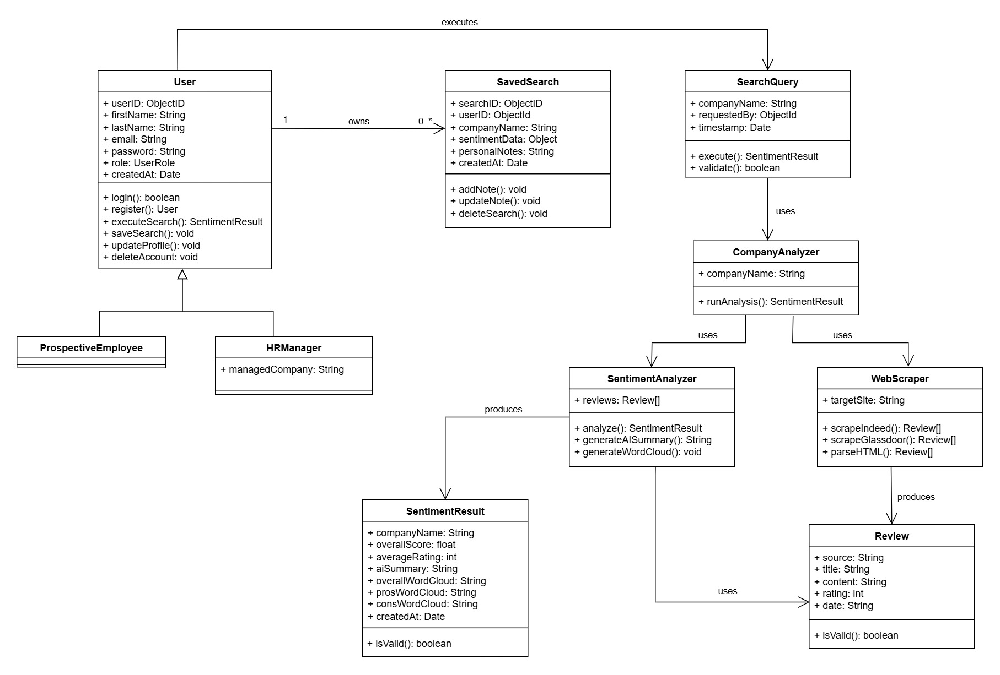
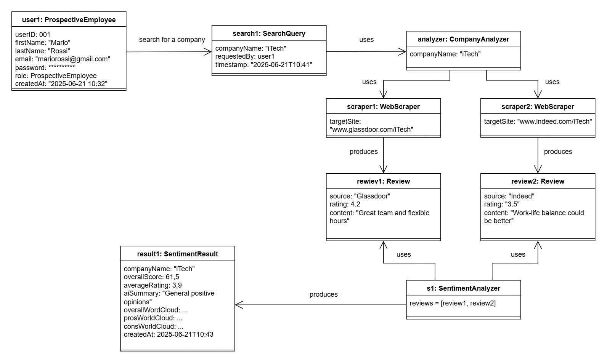

# Design

## Behaviour Diagram Design

Behavior diagrams represent the dynamic aspect of the system.
1.	It emphasizes what must happen in the system being modeled 
2.	extensively used to describe the functionality of software systems

### Activity diagram GIUBU

Activity diagrams are a technique to describe procedural logic, business process, and workflow – they play a role similar to flowcharts, but the principal difference between them and flowchart notation is that they support parallel behavior. 

The activity diagram outlines the key processes and workflows within the CompanyWindow application. It shows the steps taken from when a user searches for a company, through the collection of employee reviews from sources (like Glassdoor or Indeed), to the sentiment analysis of the reviews. The workflow includes steps such as web scraping, data analysis, storing results, and displaying the sentiment and company insights (like pros/cons and overall evaluation) to the user. It also explains the key processes to sign up and to save a company in the user’s personal library.

### State Machine Diagram
State Machine Diagrams show the different states of an entity. State machine diagrams can also show how an entity responds to various events by changing from one state to another.

 
The front end of the system can be viewed as an entity that passes through different states. Typically, a user visiting the site starts on the home page, searches for the company they are interested in, waits for the request to be processed, and then views the relevant content. This state flow is shown in yellow in the diagram. These states also interact with other sub-states, such as the backend processing the request and the library page that the user can access.

### Interaction Overview Diagram 
The Interaction Overview Diagram (IOD) illustrates the sequence of interactions between different components of the system, focusing on the actions a user can perform while navigating the software. 

  
This diagram represents the flow of actions that a user follows when researching a company's information on the platform.
+ *Initial state*: the system is waiting for a user action.
+ *Browse or Search*: The user can either set the browse options or search for a specific company. These two interactions trigger different components:
    + Browsing takes the user to a browser configuration phase.
    + Searching leads to retrieving information about a company item.
+ *Viewing items*: After browsing or searching, the user enters the View Item state where they can review the retrieved data about the company.
+ *Login Requirement*: When the user needs to perform actions such as reviewing or interacting with items (e.g., adding to a library), they are prompted to log in. The registration process allows users to register if they don't already have an account.
+ *Review items*: Once logged in, the user can
    + View their library to see previously added items.
    + Add items to the library for future reference.
    + Manage the library: The user can also perform actions such as updating or deleting items in the library to ensure their collection remains relevant.
    + Liking items: Users can express their preferences by liking items as part of their interaction with the system.
+ *Completion*: After the sequence of interactions, the system concludes with the done state, indicating the completion of the user's activity flow.

### Sequence Diagram

Company Search Sequence Diagram 

This sequence diagram illustrates the interaction between the user and system components during a company search. It details the process from when a user inputs a company name, to when the system scrapes reviews from external sources, performs sentiment analysis, and presents the data back to the user. The diagram likely includes interactions between the user interface, the web scraper, the sentiment analysis module, and the data storage system, showing how these components communicate in a specific order. 

In this sequence diagram, the interaction between the user and the system components during the registration/login process.

## Structure Diagram Design

Structure diagrams represent the static aspects of the system.  
(1) It emphasizes the things that must be present in the system being modelled;  
(2) extensively used in documenting the software architecture of software systems.

### Component diagram 

The architecture depicted in the image is a layered architecture that includes the following components:  

1. **Frontend Layer**  
   • **React/Vite Application**: Built with React, Vite and TypeScript, this component represents the client-side application. It provides the User Interface (UI) for all user interactions, from submitting search queries to displaying the final reports.  

2. **API Layer**  
   • **Node.js/Express REST API**: This layer serves as the central communication hub. It's a RESTful API developed with Node.js and the Express.js framework. It handles requests from the frontend, manages user authentication, and orchestrates the backend processing by communicating with the various services.  

3. **Backend Logic Layer**  
   · **Python Orchestrator (company_analyzer.py)**: This is the core logic component that coordinates the entire analysis workflow. Triggered by the Node.js server, it launches the scraping and sentiment analysis scripts in sequence.  
   · **Web Scraping Scripts**: These are dedicated Python scripts that dynamically generate URLs to scrape data from external sources like Indeed and Glassdoor. They output the collected data into a structured format for further processing.  
   · **Sentiment Analysis Script (sentiment.py)**: This script processes the raw data from the scraping scripts. It performs text analysis, generates an AI summary using the Gemini 1.5 API, and creates word cloud images.  
   · **Database Manager**: Implemented within the Node.js backend, this component is responsible for all operations on the MongoDB database, including storing user information, managing saved searches, and handling notes.  

4. **Data Layer**  
   · **MongoDB Database**: A NoSQL database that acts as the centralized persistent storage for the application. It stores user profiles, their roles, and all saved searches along with their custom notes.  
   · **Sentiment Results Directory (data/sentiment_results)**: This is a file-based storage system where the final processed JSON reports and the generated word cloud images are saved, ready to be served to the frontend.  

### Class Diagram

The diagram below shows the CompanyWindow system, a platform designed to help users explore and evaluate company reputations based on online reviews and sentiment analysis. The structure emphasizes user interaction, data collection, and automated insights.

At the center is the **User** class, which defines the basic attributes and actions of anyone using the platform. It includes fields like `name`, `email`, and `role`, along with methods for logging in, managing profiles, and performing searches. Two subclasses extend this base:
- **ProspectiveEmployee**: representing individuals exploring employment opportunities
- **HRManager**: which includes an additional attribute to track the company under management

Searches are handled by the **SearchQuery** class, which stores the company name, the user who initiated the search, and the timestamp. This class interacts directly with the **CompanyAnalyzer**, which coordinates the analysis process.

To gather data, the system uses the **WebScraper**, which pulls reviews from platforms like Indeed and Glassdoor. These are stored as **Review** objects, each containing details like `rating`, `source`, and `content`.

Once the reviews are collected, the **SentimentAnalyzer** processes them to extract meaningful insights. It generates summaries and word clouds, which are saved in **SentimentResult** objects. These results help users quickly understand the general sentiment around a company, including its strengths and weaknesses.

Users can save their searches using the **SavedSearch** class, which links results to the user and allows for personal notes. This makes it easier to revisit and compare companies over time.

In summary, the diagram presents a clear and organized system where each class plays a specific role. The overall design supports a smooth user experience and delivers useful, data-driven insights in a way that’s both accessible and practical.

### Object Diagram

This object diagram illustrates the system’s behavior during a typical user interaction. In this scenario, the user `user1:ProspectiveEmployee`, identified as *Mario Rossi*, initiates a search for the company *iTech*. This action is captured by the `search1:SearchQuery` object, which records the company name, the user who made the request, and the timestamp.

The search is handled by the CompanyAnalyzer, which coordinates the data collection process. Two WebScraper objects (`scraper1` and `scraper2`) retrieve reviews from Glassdoor and Indeed. These reviews are stored in `review1` and `review2`, each containing a rating and a brief comment.

The reviews are then analyzed by the SentimentAnalyzer, which produces a comprehensive summary represented by the `result1:SentimentResult` object. This includes an overall sentiment score, average rating, AI-generated summary, and word clouds highlighting frequently mentioned pros and cons.

Overall, the diagram provides a clear view of how different components interact to transform a user’s query into a structured and insightful analysis. It complements the class diagram by showing real instances and their relationships at a specific moment in time.

## Data-related aspects

The system's data schema is designed to support the core functionalities of the application by leveraging the flexibility of a NoSQL database like MongoDB.  

**Data Schema**  
The database architecture is based on a collection of documents, which is ideal for the heterogeneous nature of the data managed by the system. The main collections are:  

1. **User Data**: This collection stores information related to registered users. Each user document contains profile details and manages the user's role (HR Manager or Prospective Employee), ensuring personalized access to application features.  
   - *Example Fields*: `userID`, `email`, `password_hash`, `role`, `companyName` (optional for HR Managers).  

2. **Saved Searches**: This collection is the core of the "Saved Searches" functionality. Each document represents a search saved by a user, including the full analysis report and custom notes. This document-based schema is particularly effective for saving the complex JSON-formatted results generated by the backend.  
   - *Example Fields*: `savedSearchID`, `userID`, `companyName`, `analysisDate`, `aiSummary`, `verage_sentiment_combined`, `wordClouds`, `average_rating`, `indicator_combined`, `word_frequencies_combined`, `pros`, `cons`.  

3. **Sentiment Analysis Results**: The complete analysis reports, generated by the `sentiment.py` script, are saved in a JSON format. While the main data is included in the Saved Searches collection, the final JSON files and word cloud images are stored on disk for easy retrieval by the frontend.  

**Data Persistence Technologies**  
The application utilizes a single persistence system to maintain a simple and scalable architecture:  
- **Document Database (MongoDB)**: Used to manage all application data, including structured user data and the semi-structured data of saved searches. Its flexibility allows us to easily adapt the data schema to future requirements without the rigidity of a relational schema.  
