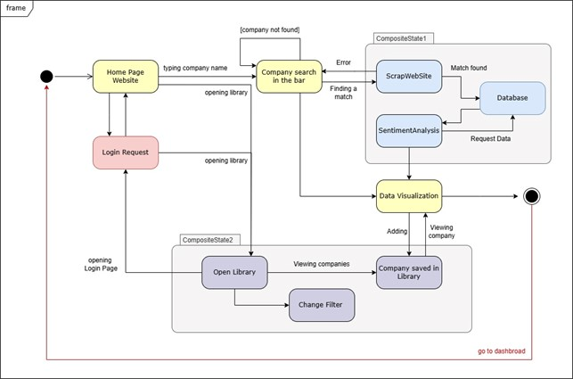
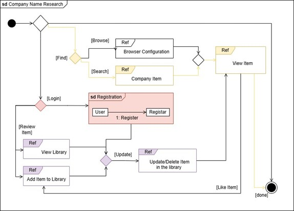

# Design

## Behaviour Diagram Design

Behavior diagrams represent the dynamic aspect of the system.
1.	It emphasizes what must happen in the system being modeled 
2.	extensively used to describe the functionality of software systems

### Activity diagram GIUBU

Activity diagrams are a technique to describe procedural logic, business process, and workflow – they play a role similar to flowcharts, but the principal difference between them and flowchart notation is that they support parallel behavior. 

The activity diagram outlines the key processes and workflows within the CompanyWindow application. It shows the steps taken from when a user searches for a company, through the collection of employee reviews from sources (like Glassdoor or Indeed), to the sentiment analysis of the reviews. The workflow includes steps such as web scraping, data analysis, storing results, and displaying the sentiment and company insights (like pros/cons and overall evaluation) to the user. It also explains the key processes to sign up and to save a company in the user’s personal library.

### State Machine Diagram
State Machine Diagrams show the different states of an entity. State machine diagrams can also show how an entity responds to various events by changing from one state to another.

 
The front end of the system can be viewed as an entity that passes through different states. Typically, a user visiting the site starts on the home page, searches for the company they are interested in, waits for the request to be processed, and then views the relevant content. This state flow is shown in yellow in the diagram. These states also interact with other sub-states, such as the backend processing the request and the library page that the user can access.

### Interaction Overview Diagram 
The Interaction Overview Diagram (IOD) illustrates the sequence of interactions between different components of the system, focusing on the actions a user can perform while navigating the software. 

  
This diagram represents the flow of actions that a user follows when researching a company's information on the platform.
+ *Initial state*: the system is waiting for a user action.
+ *Browse or Search*: The user can either set the browse options or search for a specific company. These two interactions trigger different components:
    + Browsing takes the user to a browser configuration phase.
    + Searching leads to retrieving information about a company item.
+ *Viewing items*: After browsing or searching, the user enters the View Item state where they can review the retrieved data about the company.
+ *Login Requirement*: When the user needs to perform actions such as reviewing or interacting with items (e.g., adding to a library), they are prompted to log in. The registration process allows users to register if they don't already have an account.
+ *Review items*: Once logged in, the user can
    + View their library to see previously added items.
    + Add items to the library for future reference.
    + Manage the library: The user can also perform actions such as updating or deleting items in the library to ensure their collection remains relevant.
    + Liking items: Users can express their preferences by liking items as part of their interaction with the system.
+ *Completion*: After the sequence of interactions, the system concludes with the done state, indicating the completion of the user's activity flow.

### Sequence Diagram

Company Search Sequence Diagram 

This sequence diagram illustrates the interaction between the user and system components during a company search. It details the process from when a user inputs a company name, to when the system scrapes reviews from external sources, performs sentiment analysis, and presents the data back to the user. The diagram likely includes interactions between the user interface, the web scraper, the sentiment analysis module, and the data storage system, showing how these components communicate in a specific order. 

In this sequence diagram, the interaction between the user and the system components during the registration/login process.

## Structure Diagram Design

-

### Component diagram 

- 

### Class Diagram

- 

### Object Diagram

-

## Data-related aspects
- This section explains all the details related to the data, for instance:
    - Data schema
    - Data persistence technologies (if used), for example: MySQL, MongoDB, ...